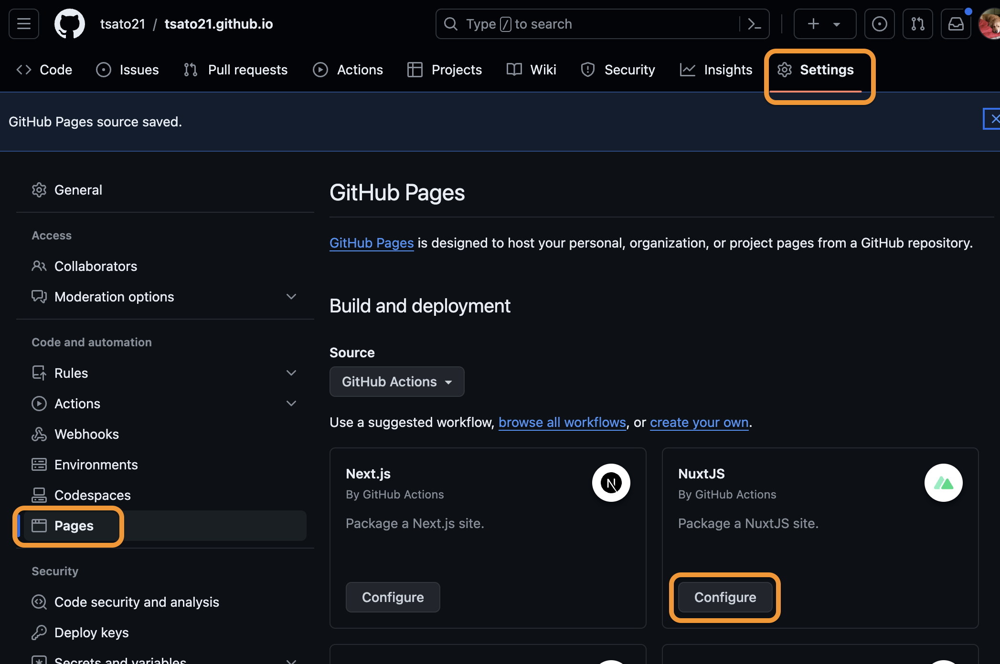
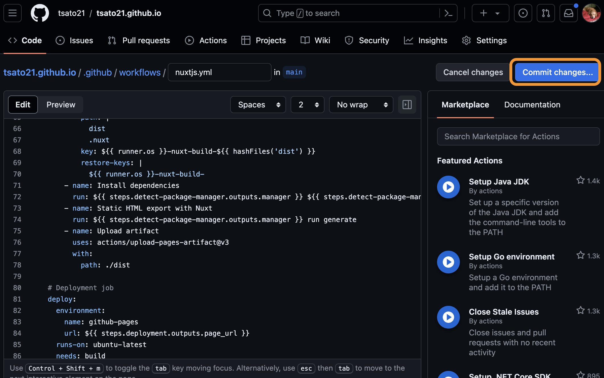

# Deployment of Nuxt Application to Github Pages Infrastructure
This repository, [Scripts Showcase](https://tsato21.github.io/), is my personal website to feature the tools that I have created.

It uses Nuxt Feature to pre-render the Vue files into static HTML files.

This README describes how the website has been created by Nuxt and Github Page.

## Setup
1. Install Node.js and check the version. Nuxt 3 requires Node.js version 18 or higher.

    ```bash
    nodenv install 18.0.0
    node -v
    ```

2. Choose a directory where you want to set a new project.

    ```bash
    cd path/to/your/directory
    ```

3. Start a new Nuxt project.

    ```bash
    npx nuxi@latest init <project-name>
    ```

- You will be asked for several items for set up.

    ```bash
    ❯ Which package manager would you like to use?
    ● npm
    ○ pnpm
    ○ yarn
    ○ bun
    ```

    ```bash
    ❯ Initialize git repository?
    ● Yes / ○ No
    ```

4. Navigate to the new project directory.

    ```bash
    cd <directory-name>
    ```

5. Delete `app.vue`, which is created by Nuxt by default.

    ```bash
    rm /app.vue
    ```

6. Organize the directory structure as you prefer. The structure of this repository is as follows:

    ```
    │
    └───src
        │
        ├───layouts
        │
        └───pages
        |
        |
        └───components
        |
        |
        └───assets
    ```

7. Create an empty file `.nojekyll` at the following directory to prevent GitHub Pages from processing the site with Jekyll.

    ```
    │
    └───public
        │
        └───.nojekyll
    ```

8. Define srcDir in `nuxt.config.ts`.

    ```ts
    srcDir: "src/",
    ```

9. Create directories and file for github actions

    ```
    │
    └───.github
        │
        └───workflows
    ```

- Codes for `nuxtjs.yml` will be introduced by Github at the later setup. You can find codes that I used in `nuxtjs.yml` in this repository.

10. Create a GitHub repository and set up the `Build and deployment` in the Pages section of the repository settings. Navigate to `Settings` > `Pages` and change `Sources` to `Github Actions`. After changing the setting, GitHub will provide several options for yml codes. Choose `nuxtjs.yml` and configure to put the file.



11. Pull the changes from main branch in gihub to local branch. And then, start making your sites in local branch.

- You can check the output by `npm run dev` in Terminal.

12. Add, commit, and push your changes into Github repository.

13. Merge the updates into the main branch in Github.

- This automatically executes Github actions to deploy the github page.

14. Check the status of the actions in `Actions` in Github. If it is succeeded, the site is available through Github page.

## Optional Settings

### Tailwindcss
Tailwindcss is a utility-first CSS framework that can be used to build custom designs. To use it in your Nuxt project:

1. Add dependencies.

    ```bash
    npm install --save-dev @nuxtjs/tailwindcss
    ```

2. Updated modules in `nuxt.config.ts`.

    ```ts
    modules: ['@nuxtjs/tailwindcss'],
    ```

### Nuxt Icon

Nuxt Icon is a module that makes it easy to use SVG icons in your Nuxt project. To use it:

1. Add dependencies.

    ```bash
    npm install --save-dev nuxt-icon
    ```

2. Updated modules in `nuxt.config.ts`.

    ```ts
    modules: ['nuxt-icon'],
    ```

### Favicon

1. Put an image for the favicon in the `public` directory. The image should be named `favicon.png` and should be in suitable format.

2. Update `nuxt.config.ts`.

    ```ts
    app: {
        head: {
            link: [
                { rel: 'icon', type: 'image/png', href: '/favicon.png' },
            ],
        },
    },
    ```

### Pass Image Paths to Component Files

When you need to pass an image path as a variable to component files, place the image files in the `public` directory. This is because files in the `public` directory are served as they are, allowing for reliable referencing in your code.

On the other hand, the `assets/images/` directory is processed by webpack, Nuxt's bundler. This processing can change file names and locations, making it unsuitable for passing reliable image paths to components.

In this repository, the banner for my tool uses the `public` directory approach. See `src/components/Banner.vue`, `src/public/banner`, and `src/pages/gas-tools/each-tool/sheet-tasker.en.vue` for the details.

## References

- [Tailwindcss](https://tailwindcss.nuxtjs.org/): Documentation for the Tailwindcss module for Nuxt.
- [Nuxt Icon](https://nuxt.com/modules/icon): Documentation for the Nuxt Icon module.
- [Deployment of Nuxt Application to GitHub Pages Infrastructure](https://nuxt.com/deploy/github-pages): Instructions for deploying a Nuxt application to GitHub Pages.